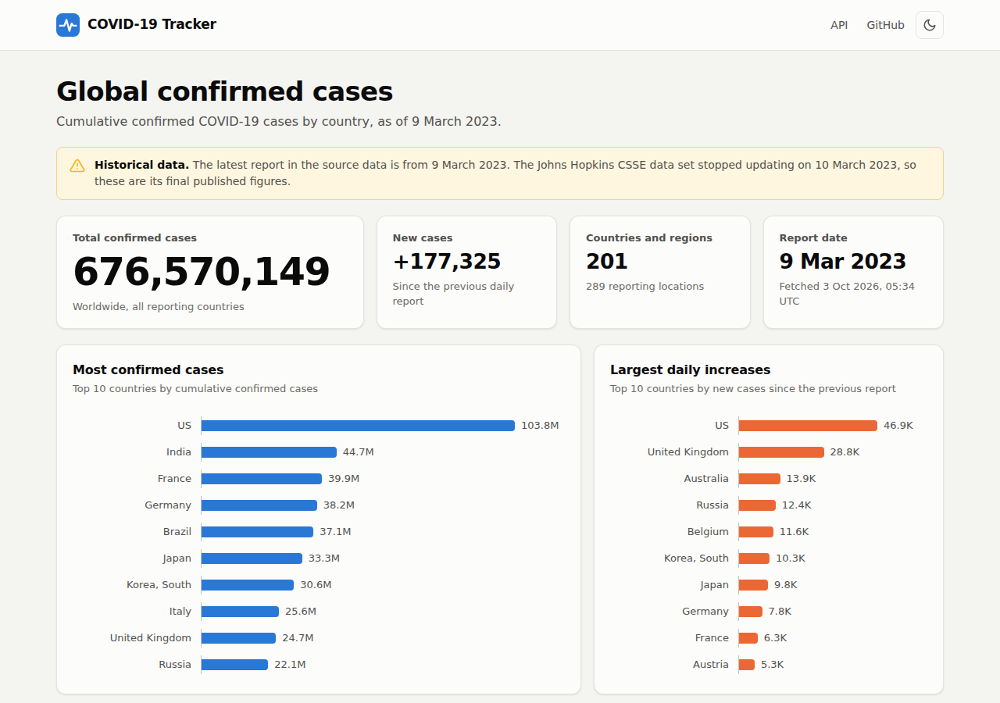
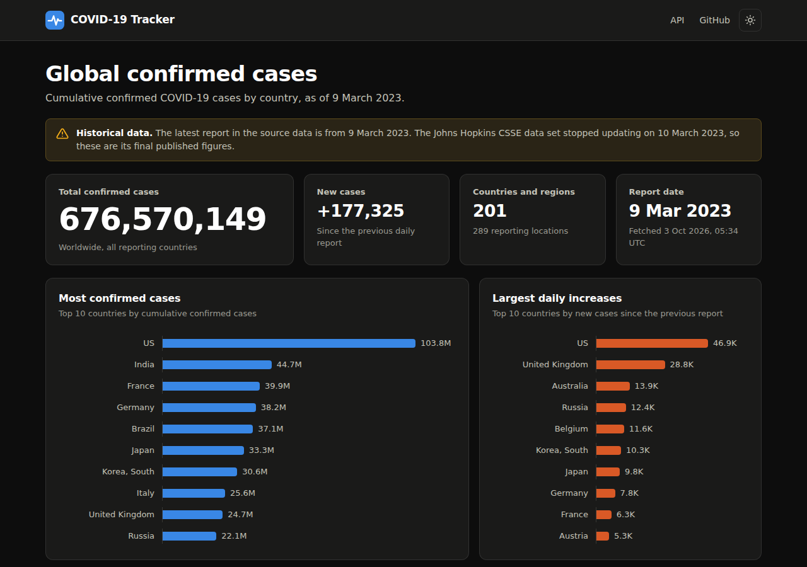
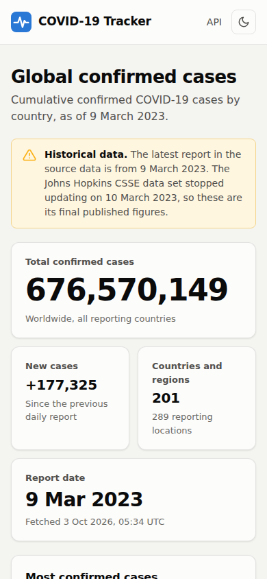
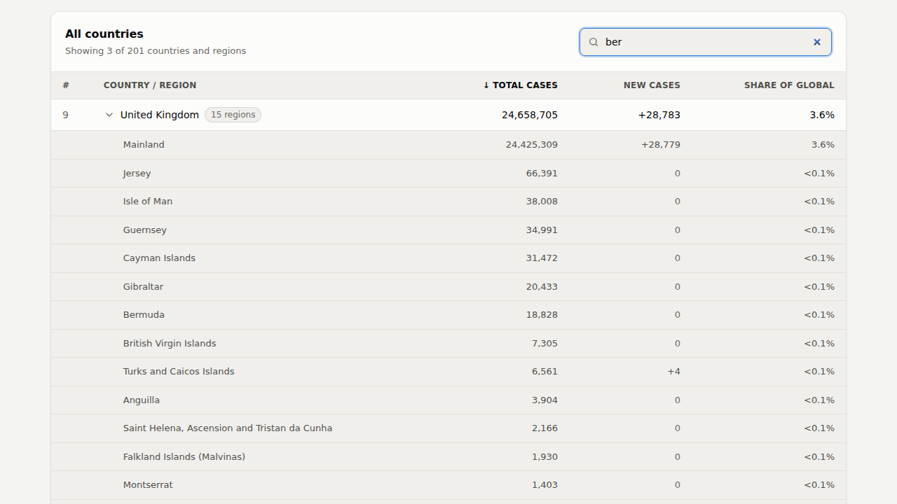

# COVID-19 Tracker

[](https://github.com/archiforge/covid19-tracker/actions/workflows/ci.yml)


A Spring Boot dashboard for global confirmed COVID-19 cases, built on the
[Johns Hopkins University CSSE](https://github.com/CSSEGISandData/COVID-19) time-series data set.



<table>
  <tr>
    <td width="66%"></td>
    <td width="34%"></td>
  </tr>
</table>

## Features

- **At-a-glance figures:** global cumulative cases, new cases since the previous report, number of
  reporting countries and the report date.
- **Charts:** the 10 countries with the most cases and the 10 with the largest daily increase.
  Hover over or focus a bar for exact figures.
- **Country table:** every country with its total, new cases and share of the global total.
  Sort by any column, search instantly, and expand countries such as Australia, Canada, China or
  the United Kingdom to see their states, provinces and territories.
- **Light and dark themes** that follow your system setting, with a toggle to override it.
- **Responsive and accessible:** works down to small phones, is keyboard navigable, and stays
  fully readable without JavaScript.
- **JSON API** serving the same figures as the dashboard.
- **Resilient:** a failed download never takes the app down or discards data already loaded.
  The app keeps serving what it has and retries.



> [!NOTE]
> Johns Hopkins University stopped collecting COVID-19 data on 10 March 2023, so the latest report
> in the data set is from 9 March 2023. The dashboard says so in a banner. You can point the app at
> any other CSV in the same format; see [Configuration](#configuration).

## Quick start

You need **JDK 21 or later**. The Maven wrapper downloads Maven for you.

```bash
cd covid19_case_tracker
./mvnw spring-boot:run
```

Then open <http://localhost:8081>. The data (about 2 MB) downloads in the background on startup,
so the first page view may briefly show a loading message.

### Docker

```bash
docker build -t covid19-tracker covid19_case_tracker
docker run --rm -p 8081:8081 covid19-tracker
```

The image builds the app in a JDK container, then runs it on a JRE-only image as a non-root user.

## Configuration

Settings live in
[`application.properties`](covid19_case_tracker/src/main/resources/application.properties).
Each can be overridden as an environment variable (`tracker.read-timeout` → `TRACKER_READ_TIMEOUT`)
or a command-line argument (`--tracker.read-timeout=2m`).

| Property                  | Default                                 | Description                                                                                            |
|---------------------------|-----------------------------------------|--------------------------------------------------------------------------------------------------------|
| `server.port` / `PORT`    | `8081`                                  | HTTP port. The `PORT` variable is honoured for platforms like Heroku, Render or Cloud Run.             |
| `tracker.data-url`        | JHU CSSE confirmed cases (global)       | CSV in the JHU CSSE `time_series_covid19_*_global` format.                                             |
| `tracker.refresh-cron`    | `0 0 10 * * *`                          | When to re-download the data, as a [Spring cron expression][cron]. Use `-` to disable.                 |
| `tracker.retry-interval`  | `5m`                                    | While no data has loaded, how often to retry.                                                          |
| `tracker.load-on-startup` | `true`                                  | Download the data as soon as the app starts.                                                           |
| `tracker.connect-timeout` | `10s`                                   | Maximum time to connect to the data source.                                                            |
| `tracker.read-timeout`    | `60s`                                   | Maximum time to finish downloading.                                                                    |
| `tracker.stale-after`     | `7d`                                    | Show the "historical data" banner once the latest report is older than this.                           |

[cron]: https://docs.spring.io/spring-framework/reference/integration/scheduling.html#scheduling-cron-expression

## JSON API

| Endpoint                        | Returns                                                      |
|---------------------------------|--------------------------------------------------------------|
| `GET /api/summary`              | Headline figures                                             |
| `GET /api/countries`            | Every country, largest first, with its regions               |
| `GET /api/countries/{country}`  | One country, matched case-insensitively (e.g. `united%20kingdom`) |

```console
$ curl -s localhost:8081/api/summary
{"reportDate":"2023-03-09","fetchedAt":"2026-10-03T05:31:25.536616469Z","totalCases":676570149,"newCases":177325,"countries":201,"locations":289}

$ curl -s localhost:8081/api/countries/us
{"country":"US","totalCases":103802702,"newCases":46931,"regions":[]}
```

Errors use [RFC 9457](https://www.rfc-editor.org/rfc/rfc9457) problem details
(`application/problem+json`). Before the first successful download, every endpoint responds
`503 Service Unavailable` with a `Retry-After` header.

## Development

```bash
cd covid19_case_tracker
./mvnw verify    # compile and run all tests
```

The tests run offline against a small sample CSV in `src/test/resources/data`. They cover the
parser's edge cases, aggregation, the refresh and failure behaviour, the HTML and JSON endpoints,
and the full application on a real HTTP port.

### Project layout

```
covid19_case_tracker/src/main/java/com/lawlite/covid/
├── CovidTrackerApplication.java   Entry point
├── config/                        Typed settings and the HTTP client
├── data/                          CSV download and parsing
├── model/                         Immutable records: locations, countries, snapshot
├── service/                       Holds the current snapshot and refreshes it on a schedule
└── web/                           Dashboard, JSON API and view formatting
```

The UI is server-rendered with Thymeleaf (`src/main/resources/templates`), with plain CSS and
JavaScript in `src/main/resources/static` and no front-end build step.

## Data source and licence

Case data comes from the
[COVID-19 Data Repository by the Center for Systems Science and Engineering (CSSE) at Johns Hopkins University](https://github.com/CSSEGISandData/COVID-19),
licensed under [CC BY 4.0](https://creativecommons.org/licenses/by/4.0/). This project is not
affiliated with Johns Hopkins University.
